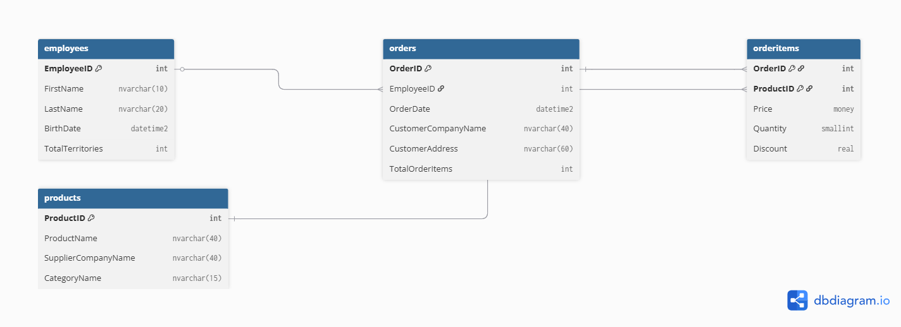

# 🧭 ER Diagram Overview

This document provides an overview of the entity-relationship diagrams (ERDs) relevant to this SQL project. It includes a visual representation of the custom database used, as well as reference diagrams from sample databases for advanced querying tasks.

---

## 📌 Custom Database: OrdersManagementDB

The following ER diagram illustrates the core structure of the custom `OrdersManagementDB` used in this project. It contains the key entities and relationships needed to support the advanced SQL queries implemented.



> ### Relationships:
> - One employee (`Employees`) can create many orders (`Orders`)
> - Each order contains one or more items (`OrderItems`)
> - Each item in the order references a product (`Products`)
> 
> This schema is designed to support normalized data and efficient query performance.

---

## 📦 Reference Diagrams for Sample Databases 

The project also includes advanced SQL queries against industry-standard sample databases: **Northwind**, **Pubs**, and **AdventureWorks2017**. Below are optional diagrams for reference:

| Sample Database   | Format | Path or Link |
|-------------------|--------|--------------|
| Northwind         | PNG    | `./reference_diagrams/northwind.png` |
| Pubs              | PNG    | `./reference_diagrams/pubs.png` |
| AdventureWorks2017| PDF    | [Official Diagram (Microsoft Docs)](https://learn.microsoft.com/en-us/sql/samples/adventureworks-install-configure) |

> Note: These diagrams are provided for contextual understanding only. They were not created by the author but sourced from Microsoft or community resources.

---

## 🛠️ Tools Used

- [dbdiagram.io](https://dbdiagram.io) – For custom ERD generation  
- SQL Server Management Studio – To inspect existing schemas  
- Microsoft Docs – For official reference diagrams  

---

## 📁 File Structure

```
docs/
├── er_diagram_placeholder.md
├── er_diagram.png
└── reference_diagrams/
    ├── northwind.png
    ├── pubs.png
    └── adventureworks.pdf
```

You can view or download the custom and sample ER diagrams directly from this folder.

